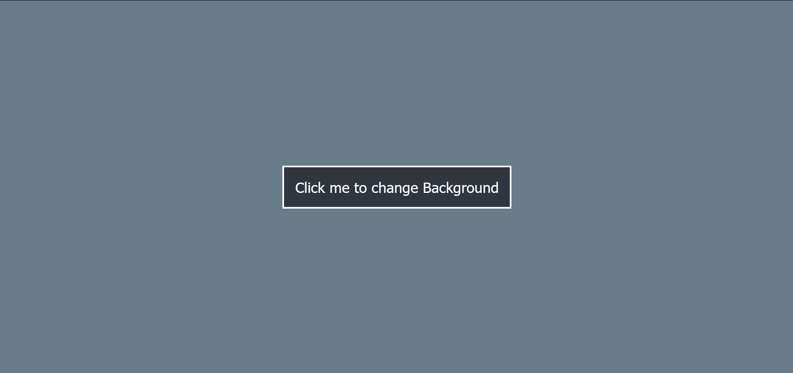

# BODY COLOR CHANGER
     
  
  

# Description of the project
- In this project, whenever the button is clicked the  background color of body will get changed to a random color which is generated by a function in js file.

## Concepts learnt through this project
- How to select html elements
- How to manipulate html elements using javascript
- Writing functions 
- Adding Event Listener

# Output:
  

### Time Taken - 30 minutes