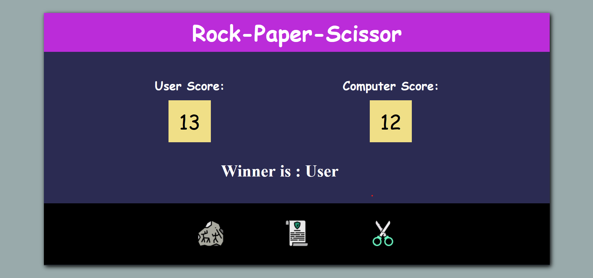

# Rock Paper Scissor
     
  
  

# Description of the project
- In this project, I have designed a rock paper scissor game , where user selects a choice and computer selects one choice and winner among them is displayed.

## Concepts learnt through this project
- How to select html elements
- How to manipulate html elements using javascript
- Writing functions 
- Adding Event Listener
- Logic building
- changing text
- getting values of attributes

# Output:
  

### Time Taken - 3 hour