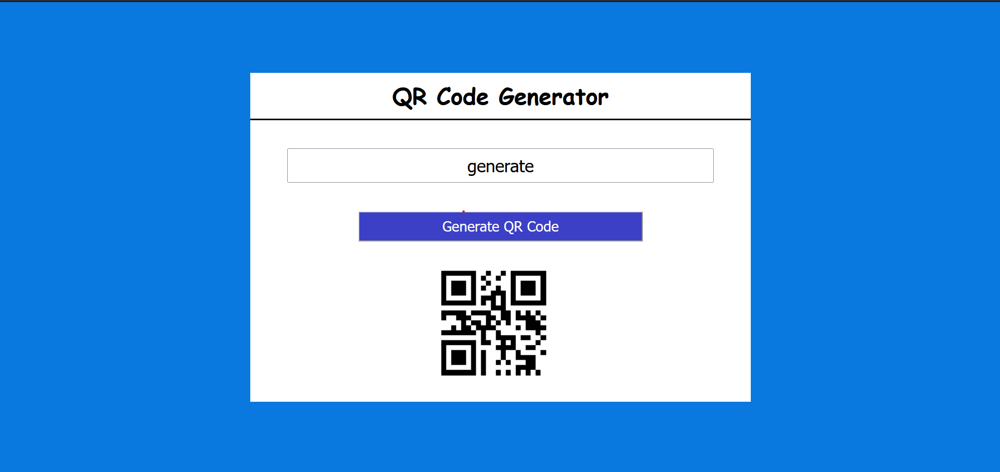

# QR Code Generator
     
  
  

# Description of the project
- In this project, I have designed a QR Code generator which generates a QR Code according to the given text.

## Concepts learnt through this project
- How to select html elements
- How to manipulate html elements using javascript
- Adding Event Listener
- changing text
- fetching data from API

# Output:
  

### Time Taken - 1/2 hour